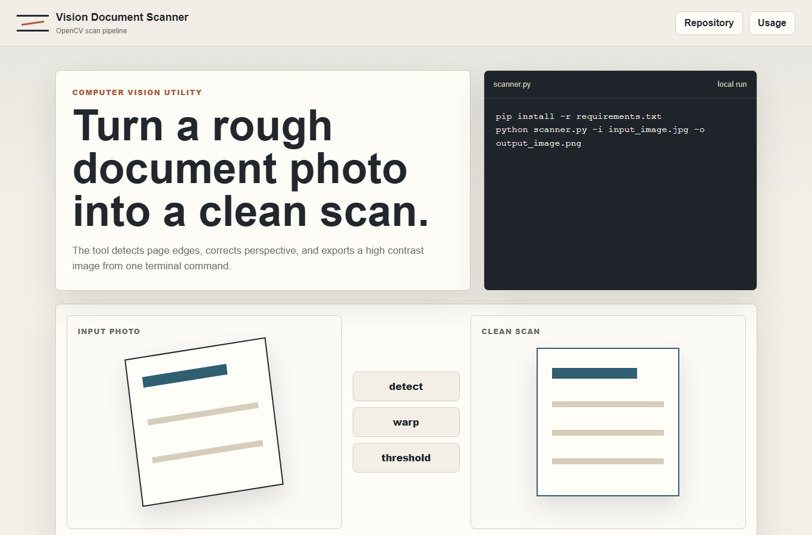

<!-- portfolio:start -->
<p align="center">
  
</p>

<h1 align="center">Vision Document Scanner</h1>

<p align="center"><strong>A crisp document capture workflow for edge detection, perspective correction, and export-ready scans.</strong></p>

<p align="center">

  
  
</p>

## Scanner Character

Clean, paper-first, and practical. The repo reads like a compact lab notebook for turning camera input into usable documents.

## What It Does

Detects document edges, corrects perspective, and presents a small web surface for understanding the workflow.

## Try It

`pip install -r requirements.txt` then run `python scanner.py`.

## Portfolio Note

This repository has its own visual identity inside the portfolio. The goal is that every project feels like a different product, not another copy of the same template.
<!-- portfolio:end -->

---

## Existing Project Notes

# Vision Document Scanner

Vision Document Scanner is a small computer vision utility that turns a photo of a document into a clean scanned image. It detects the document edges, corrects perspective, converts the result to grayscale, and applies adaptive thresholding for a high contrast output.



## What It Does

- Detects the largest document-like contour in a photo.
- Applies a four-point perspective transform.
- Produces a clean black and white scan.
- Works from the terminal with one command.
- Uses only Python, OpenCV, and NumPy.

## Requirements

```bash
pip install -r requirements.txt
```

## Usage

```bash
python scanner.py -i input_image.jpg -o output_image.png
```

## Example Workflow

1. Take a photo of a document on a contrasting background.
2. Run the scanner with the image path.
3. Open the generated PNG.
4. If the document is not detected, try a photo with clearer edges and less blur.

## Project Goal

The project is intentionally simple: one useful command that demonstrates document detection, perspective correction, and scan-style image processing.
